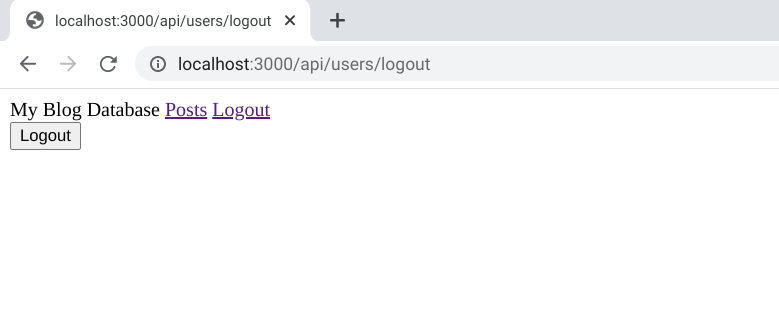

<h1 align="center">Blog API</h1>

   Solution for a challenge from  <a href="https://www.theodinproject.com/paths/full-stack-javascript/courses/nodejs/lessons/blog-api" target="_blank">theodinproject.com</a>.

## Table of Contents

- [Overview](#overview)
  - [Built With](#built-with)
  - [Thoughts](#thoughts)
- [Features](#features)
- [Improvements](#improvements)
- [Useful Resources](#useful-resources)

## Overview

The [exercise](https://www.theodinproject.com/paths/full-stack-javascript/courses/nodejs/lessons/blog-api) was to create a front-end site just for you to write, edit and publish your posts.   

### Built With

- Express
- Bcrypt
- JWT

### Thoughts

- Passport community doesn't seem very active and I find the documentation to be terrible.
- Used Node crypto module to generate jwt token secret - require('crypto').randomBytes(64).toString('hex')
- Originally, used checkbox before converting to radio button instead.

## Features

- Have to create user account and be logged in to 'crud' posts.  
- Simple JWT implementation 

## Improvements

- Prevent Login route from showing after logging in
- Add Comment functionality 

### Resources

- [JWT](https://jwt.io)
- [Stack Overflow](https://stackoverflow.com/questions/23595282/error-no-default-engine-was-specified-and-no-extension-was-provided) - express engine 
- [Blog](https://newbedev.com/fetch-api-not-working-with-localhost-127-0-0-1) - fetch api localhost
- [Blog](https://medium.com/@mariorodriguezan/react-native-fetch-request-to-http-localhost-3000-ce11a36337ca) - fetch api localhost
- [JavaScript Tutorial](https://www.javascripttutorial.net/javascript-fetch-api/) - fetch api
- [Stack Overflow](https://stackoverflow.com/questions/53215483/how-do-i-find-out-the-ip-address-of-my-crostini-container) - Crostini IP
- [Stack Overflow](https://stackoverflow.com/questions/43150051/how-to-enable-cors-nodejs-with-express) - CORS
- [How to create apps](https://howtocreateapps.com/fetch-and-display-json-html-javascript/) - fetch api
- [Flexiple](https://flexiple.com/blog/javascript-appendchild/) - appendChild()
- [MDN Docs](https://developer.mozilla.org/en-US/docs/Web/API/Document/createElement) - createElement
- [Auth0](https://auth0.com/blog/node-js-and-express-tutorial-building-and-securing-restful-apis/) - tutorail 
- [YouTube](https://www.youtube.com/watch?v=fgTGADljAeg) - WDS
- [YouTube](https://www.youtube.com/watch?v=2jqok-WgelI) - Dev Ed
- [Express Validator](https://express-validator.github.io/docs/#basic-guide) - express validator docs
- [Stack Overflow](https://stackoverflow.com/questions/36558909/route-get-requires-callback-functions-but-got-a-object-undefined) - route object
- [Blog](https://medium.com/kanlanc/heres-why-storing-jwt-in-local-storage-is-a-great-mistake-df01dad90f9e) - Local Storage & JWT
- [Stack Overflow](https://stackoverflow.com/questions/23751914/how-can-i-set-response-header-on-express-js-assets) - response header
- [Forum](https://devforum.zoom.us/t/jwt-does-not-work-in-live-but-works-in-postman/37857/5) - jwt issues
- [Stack Abuse](https://stackabuse.com/authentication-and-authorization-with-jwts-in-express-js/) - jwt
- [Stack Overflow](https://stackoverflow.com/questions/48299135/pass-jwt-in-header) - jwt
- [Dev.to](https://dev.to/franciscomendes10866/using-cookies-with-jwt-in-node-js-8fn) - cookies & jwt
- [Stack Overflow](https://stackoverflow.com/questions/23966716/javascript-checkbox-checked-condition) - checkbox
- [Stack Overflow](https://stackoverflow.com/questions/49088659/check-box-in-express-js) - checkbox
- [Stack Overflow](https://stackoverflow.com/questions/3521290/logout-get-or-post) - logout 
- [Section io](https://www.section.io/engineering-education/how-to-build-authentication-api-with-jwt-token-in-nodejs/) - tutorail
- [Reddit](https://www.reddit.com/r/learnprogramming/comments/awwlsl/how_to_check_if_checkbox_is_checked_using/ehpsbkt/) - checkbox